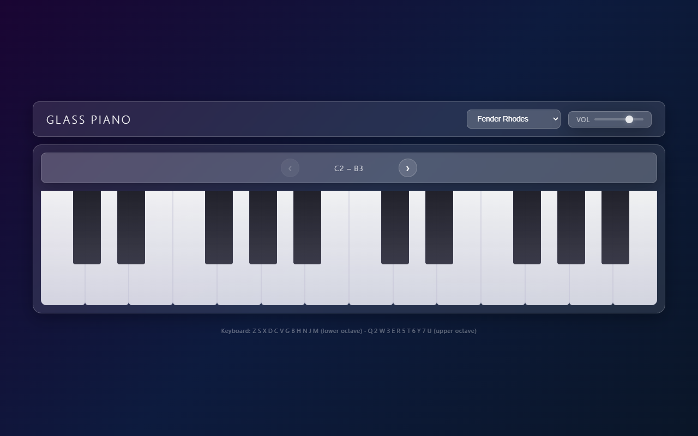

# Glass Piano

A responsive, browser-based 5-octave polyphonic synthesizer piano built with vanilla HTML, CSS, and JavaScript.



## Quick Start

No build step required. Open `index.html` directly in a modern browser:

```bash
# Option 1 — double-click the file, or:
start index.html          # Windows
open index.html           # macOS

# Option 2 — local server (avoids any file:// quirks)
npx serve .
```

Click or tap any key to start (the browser requires a user gesture before playing audio).

## How to Play

### Mouse / Touch
Click or tap piano keys directly. Multiple simultaneous touches are supported for polyphonic play on touchscreens.

### Computer Keyboard

Two rows of keys map chromatically to two octaves, starting from whichever octave is currently visible:

| Row | Keys | Notes |
|-----|------|-------|
| Lower octave | `Z` `S` `X` `D` `C` `V` `G` `B` `H` `N` `J` `M` | C C# D D# E F F# G G# A A# B |
| Upper octave | `Q` `2` `W` `3` `E` `R` `5` `T` `6` `Y` `7` `U` | C C# D D# E F F# G G# A A# B |

This is the same layout used by most virtual piano software (e.g. Ableton, FL Studio).

### Navigating Octaves

The **octave ribbon** sits directly above the keys. You can:

- **Click the arrow buttons** (`‹` / `›`) to shift one octave at a time
- **Drag the ribbon** left or right (mouse or touch) to swipe through octaves
- The label (e.g. "C3 – B4") updates in real time

Navigation is clamped so you can never scroll past C2 or B6.

### Changing Instruments

Use the **dropdown menu** in the header to switch between 10 presets. The change takes effect immediately — any currently held notes will finish naturally while new notes use the selected sound.

### Volume

The **Vol slider** in the header controls master output from silence (left) to full volume (right). It defaults to 75%.

## Instrument Presets

| Preset | Tone.js Synth | Character |
|--------|--------------|-----------|
| Fender Rhodes | `FMSynth` + Tremolo + Reverb | Warm bell-like electric piano with gentle wobble |
| Wurlitzer E-Piano | `AMSynth` + Distortion + Reverb | Brighter, reedy tone with slight grit |
| Yamaha CP-70 | `FMSynth` + Reverb | Bright electric grand, strong harmonic shimmer |
| Yamaha CP-80 | `FMSynth` + Reverb | Darker, rounder sibling of the CP-70 |
| Hohner Clavinet | `Synth` + AutoFilter + Distortion | Percussive, funky pluck (think Stevie Wonder) |
| Hohner Pianet | `FMSynth` + Tremolo + Reverb | Soft, mellow pluck with gentle vibrato |
| Juno 106 | `Synth` (fat saw) + Chorus + Reverb | Lush analog polysynth pad |
| RMI Electra-piano | `FMSynth` + Reverb | Organ-like sustain, glassy overtones |
| Yamaha DX7 Organ | `FMSynth` + Chorus + Reverb | Classic FM synthesis organ, bright and metallic |
| Nord Stage 4 Grand | `FMSynth` + Reverb | Rich grand piano approximation with long decay |

These are synthesis-based approximations using Tone.js oscillators and effects — not sample playback. Each preset is tuned to capture the essential character of the original instrument.

## Responsive Behavior

The app adapts the number of visible octaves based on screen width:

| Viewport | Visible Octaves | Trigger |
|----------|----------------|---------|
| > 768px (desktop/landscape) | 2 | `ResizeObserver` + `window.innerWidth` check |
| ≤ 768px (mobile/portrait) | 1 | Same mechanism |

A `ResizeObserver` watches the keys viewport and recalculates octave sizing whenever the container dimensions change (window resize, orientation flip, etc.). The keyboard hint footer is hidden on mobile to save space.

## Design Decisions

### Single-File Architecture

Everything lives in one `index.html` with clearly marked `<!-- STYLES -->`, `<!-- HTML -->`, and `<!-- SCRIPT -->` sections. This keeps the app zero-dependency (aside from the Tone.js CDN) and trivially deployable — just host the file anywhere.

### Glassmorphism

All UI panels use a shared `.glass` utility class:
- `background: rgba(255, 255, 255, 0.1)` — semi-transparent white
- `backdrop-filter: blur(10px)` — frosted glass effect
- `border: 1px solid rgba(255, 255, 255, 0.2)` — subtle edge highlight
- `box-shadow: 0 8px 32px rgba(0, 0, 0, 0.3)` — soft depth

The body gradient (deep violet → dark navy) provides enough contrast for the glass panels to read clearly.

### Key Layout with CSS Positioning

White keys use `flex: 1` within each octave group so they divide space evenly. Black keys are `position: absolute` with percentage-based `left` values derived from the standard piano geometry (placed at the boundaries between their neighboring white keys). This avoids hard-coded pixel widths and scales naturally to any container size.

### Viewport Sliding via CSS Transform

Rather than showing/hiding DOM elements, all 5 octave groups are always rendered. The visible window is controlled by:
1. Setting each octave group's width to `viewportWidth / visibleOctaves`
2. Applying `translateX(-offset)` to the track container
3. Clipping with `overflow: hidden` on the viewport

This gives smooth CSS-transitioned animations when navigating between octaves and avoids DOM churn.

### Pointer Events over Touch/Mouse Split

The app uses the [Pointer Events API](https://developer.mozilla.org/en-US/docs/Web/API/Pointer_Events) rather than separate `mouse*` and `touch*` handlers. Each pointer gets a unique `pointerId`, which naturally supports multi-touch polyphony without extra bookkeeping. The `touch-action: none` CSS property prevents the browser from intercepting touch gestures on the piano keys.

### Tone.js PolySynth

Each preset creates a `Tone.PolySynth` wrapping the appropriate voice type (FMSynth, AMSynth, or Synth). The PolySynth handles voice allocation automatically — when you press a key, it finds a free voice; when you release, it returns it to the pool. Max polyphony is set to 12 voices.

Effects are chained between the synth and the destination: `synth → effect1 → effect2 → speakers`. Switching presets fully disposes the old synth and effects before creating new ones to prevent audio leaks.

### Audio Context Initialization

Browsers require a user gesture before starting the Web Audio context. The app defers `Tone.start()` until the first key press (mouse, touch, or keyboard), so there's no autoplay-blocked error on load.

## Testing

Automated Puppeteer tests validate the app across three viewports:

```bash
npm install        # install puppeteer (one-time)
node test.mjs      # run the test suite
```

The tests check:
- Correct number of visible white keys (14 for desktop, 7 for mobile/tablet)
- Key activation/deactivation on pointer events
- Octave navigation via arrow buttons
- Presence of all 10 instrument presets
- Volume slider existence
- Screenshots captured for each viewport

## Tech Stack

- **HTML/CSS/JS** — vanilla, no framework
- **[Tone.js](https://tonejs.github.io/) 14.8.49** — Web Audio synthesis (loaded via CDN)
- **[Puppeteer](https://pptr.dev/)** — automated browser testing (dev dependency)

## Browser Support

Requires a modern browser with support for:
- Web Audio API
- Pointer Events
- `backdrop-filter` (glassmorphism — degrades gracefully to transparent panels in unsupported browsers)
- `ResizeObserver`
- CSS `dvh` units (falls back to `vh`)

Tested in Chrome, Edge, and Firefox.
